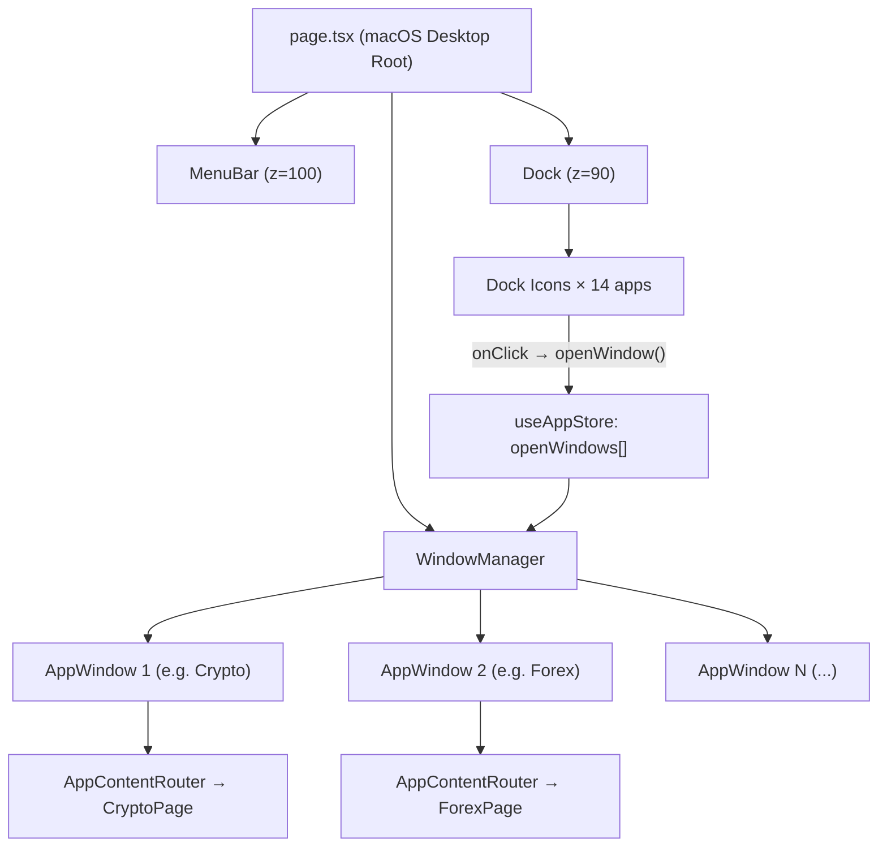

# ALTHR Terminal — macOS Ventura Migration Plan
### From: iOS 26 "Onyx & Frost" → To: macOS Ventura Desktop

---

> [!IMPORTANT]
> **What this document is:** A complete, opinionated migration strategy for a designer with solid React fundamentals but no deep systems experience. Every decision has a "why" and a "how." Read sequentially. Do not skip phases.

---

## Overview: What We're Doing & Why

### Current State (iOS 26 Liquid Glass)
The ALTHR Terminal currently runs as a **mobile-first, portrait-only** phone simulator:
- `LockScreen → HomeScreen → AppPage` navigation model
- Dynamic Island at the top, Dock at the bottom
- Fixed `100vw × 100vh` viewport, `overflow: hidden`
- All interactions are touch-based: swipe up, drag, tap
- 21 app pages served as `fixed inset-0` overlays

### Target State (macOS Ventura)
We are migrating to a **desktop-first OS metaphor**:
- `Desktop → Dock → Windows` navigation model
- Floating, draggable windows (not full-screen overlays)
- A magnifying Dock at the bottom (macOS-style)
- A Menu Bar at the top with live clock + system status
- Wallpaper fills the desktop background
- Apps open as movable, resizable panes on the desktop

### What Does NOT Change
The following are **100% preserved** — do not touch them:
- All data adapters in `/lib/adapters/` (coingecko, equities, forex, news, etc.)
- All data schemas in `/lib/schemas.ts`
- The Zustand store logic in `/store/useAppStore.ts`
- The backend API connection layer in `/lib/api.ts`
- All audio logic in `/lib/audio.ts`
- All page content logic inside `features/apps/*.tsx`

> [!NOTE]
> Think of it this way: you are changing the **shell (the OS chrome)**, not the **apps**. The data, the components, the content — all stays. Only the window frames, navigation model, and global layout change.

---

## Skills Required

This plan assumes you can do the following without help:

### ✅ Must-Have Skills
| Skill | Where you'll use it |
| :--- | :--- |
| React functional components & hooks (`useState`, `useEffect`, `useRef`) | Window manager, Dock magnification |
| Framer Motion basics (`motion.div`, `drag`, `animate`, `variants`) | Draggable windows, Dock animation |
| Tailwind CSS utility classes | All new layout components |
| Zustand: reading state with `useAppStore()` | Wiring open/close windows |
| Understanding of CSS `position: fixed` vs `absolute` | Menu Bar, Dock, Desktop layers |

### 📚 Should Learn Before Starting
| Skill | Resource | Time to Learn |
| :--- | :--- | :--- |
| `framer-motion` drag constraints | [Framer Motion docs → Drag](https://www.framer.com/motion/drag/) | 30 min |
| React Hook Form or basic controlled inputs | Any React docs | 30 min |
| CSS `z-index` stacking contexts | MDN docs | 20 min |
| Magic UI Dock component API | [magicui.design/docs/components/dock](https://magicui.design/docs/components/dock) | 1 hour |

---

## Architecture Map

### Current File Structure (iOS)
```
app/
  page.tsx           ← Master router (LockScreen / HomeScreen / AppPage)
  globals.css        ← Glass tokens, iOS wallpaper classes
features/
  lockscreen/        ← LockScreen, PinPad
  home/              ← HomeScreen, AppIcon (waterglass sphere)
  dynamic-island/    ← Island component
  notifications/     ← NotificationStack
  apps/              ← 21 app pages as full-screen overlays
store/
  useAppStore.ts     ← isLocked, activeApp, navigation state
```

### Target File Structure (macOS)
```
app/
  page.tsx           ← NEW: Desktop environment (no LockScreen)
  globals.css        ← UPDATED: macOS tokens, wallpaper, window styles
features/
  desktop/           ← NEW
    Desktop.tsx      ← The desktop canvas (background + wallpaper)
    MenuBar.tsx      ← NEW: Top menu bar (clock, wifi, battery)
    Dock.tsx         ← NEW: Bottom magnifying dock
    WindowManager.tsx← NEW: Renders all open windows
    AppWindow.tsx    ← NEW: Individual draggable window frame
  lockscreen/        ← UPDATE: replace clickable PinPad with written passcode input (Passcode: Savi2026)
  apps/              ← KEEP all 21 pages, wrapped in AppWindow instead
store/
  useAppStore.ts     ← UPDATE: add window positions, open windows array
```

---

## Phase 0: Design Tokens (Do This First)

Before writing a single component, update `app/globals.css` to replace the iOS token system with macOS Ventura tokens.

### Token Translation Guide

| Token | iOS Value (Remove) | macOS Value (Replace with) |
| :--- | :--- | :--- |
| `--bg-primary` | `#000000` | `#1e1e1e` |
| `--bg-secondary` | `#1c1c1e` | `#2d2d2d` |
| `--bg-tertiary` | `#2c2c2e` | `#3a3a3a` |
| `--bg-glass` | `rgba(255,255,255,0.08)` | `rgba(255,255,255,0.12)` |
| `--bg-glass-thick` | `rgba(255,255,255,0.15)` | `rgba(255,255,255,0.72)` |
| `--text-primary` | `#ffffff` | `#f5f5f7` |
| `--text-secondary` | `rgba(255,255,255,0.6)` | `rgba(245,245,247,0.7)` |
| `--accent` | `#0a84ff` | `#0071e3` |
| `--accent-green` | `#30d158` | `#28c840` |
| `--accent-red` | `#ff453a` | `#ff5f57` |
| `--radius-md` | `12px` | `10px` |
| `--radius-lg` | `16px` | `12px` |
| `--radius-xl` | `24px` | `16px` |

### New CSS Classes to Add

```css
/* macOS Window Chrome */
.macos-window {
  background: rgba(30, 30, 30, 0.85);
  backdrop-filter: blur(40px) saturate(180%);
  -webkit-backdrop-filter: blur(40px) saturate(180%);
  border: 1px solid rgba(255, 255, 255, 0.12);
  border-radius: 12px;
  box-shadow:
    0 0 0 0.5px rgba(0, 0, 0, 0.5),
    0 20px 60px -10px rgba(0, 0, 0, 0.8),
    0 8px 20px -4px rgba(0, 0, 0, 0.6);
}

/* macOS Traffic Lights */
.traffic-light {
  width: 12px;
  height: 12px;
  border-radius: 50%;
  cursor: pointer;
  transition: filter 0.15s;
}
.traffic-light-red    { background: #ff5f57; border: 0.5px solid rgba(0,0,0,0.2); }
.traffic-light-yellow { background: #febc2e; border: 0.5px solid rgba(0,0,0,0.2); }
.traffic-light-green  { background: #28c840; border: 0.5px solid rgba(0,0,0,0.2); }

/* macOS Menu Bar */
.macos-menubar {
  background: rgba(0, 0, 0, 0.45);
  backdrop-filter: blur(20px) saturate(180%);
  -webkit-backdrop-filter: blur(20px) saturate(180%);
  border-bottom: 0.5px solid rgba(255, 255, 255, 0.1);
}

/* macOS Desktop Wallpaper */
.bg-ventura-wallpaper {
  background: url('/wallpaper-ventura.jpg') center/cover no-repeat fixed;
}
```

### Classes to Remove from globals.css
- `.bg-lockscreen`, `.bg-homescreen-wallpaper`, `.bg-apps-wallpaper`
- `.bg-home-animated`, `.bg-island-animated`, `.bg-island-wallpaper`
- `.waterglass-sphere` (replace with Dock item styling)
- `.glass-island`, `.glass-homescreen`

---

## Phase 1: Update the Store

**File:** `store/useAppStore.ts`

The iOS store tracks a single `activeApp`. The macOS store needs to track **multiple open windows** at once.

### New State to Add

```typescript
// ADD these new interfaces and state fields

interface WindowState {
  id: string;          // unique window id (e.g. 'crypto-1')
  appId: string;       // maps to app type ('crypto', 'forex', etc.)
  title: string;
  position: { x: number; y: number };
  size: { width: number; height: number };
  isMinimized: boolean;
  zIndex: number;
}

// Add to AppState interface:
openWindows: WindowState[];
maxZIndex: number;

// Add these actions:
openWindow: (appId: AppState['activeApp'], title: string) => void;
closeWindow: (windowId: string) => void;
focusWindow: (windowId: string) => void;
minimizeWindow: (windowId: string) => void;
moveWindow: (windowId: string, pos: { x: number; y: number }) => void;
setEnteredPin: (pin: string) => void;  // NEW: for written passcode
validatePasscode: () => void;         // NEW: check Savi2026
```

### New Store Logic

```typescript
// ADD to the store create() function:
openWindows: [],
maxZIndex: 10,
correctPin: 'Savi2026',  // UPDATED passcode

openWindow: (appId, title) => set((state) => {
  const id = `${appId}-${Date.now()}`;
  const newWindow: WindowState = {
    id,
    appId,
    title,
    position: { x: 80 + state.openWindows.length * 30, y: 80 + state.openWindows.length * 30 },
    size: { width: 800, height: 600 },
    isMinimized: false,
    zIndex: state.maxZIndex + 1,
  };
  return {
    openWindows: [...state.openWindows, newWindow],
    maxZIndex: state.maxZIndex + 1,
    activeApp: appId,
    activeScreen: 'app',
  };
}),

closeWindow: (windowId) => set((state) => ({
  openWindows: state.openWindows.filter(w => w.id !== windowId),
})),

focusWindow: (windowId) => set((state) => ({
  openWindows: state.openWindows.map(w =>
    w.id === windowId ? { ...w, zIndex: state.maxZIndex + 1 } : w
  ),
  maxZIndex: state.maxZIndex + 1,
})),

minimizeWindow: (windowId) => set((state) => ({
  openWindows: state.openWindows.map(w =>
    w.id === windowId ? { ...w, isMinimized: !w.isMinimized } : w
  ),
})),

moveWindow: (windowId, pos) => set((state) => ({
  openWindows: state.openWindows.map(w =>
    w.id === windowId ? { ...w, position: pos } : w
  ),
})),

setEnteredPin: (pin) => set({ enteredPin: pin }),

validatePasscode: () => {
  const { enteredPin, correctPin, unlock } = get();
  if (enteredPin === correctPin) {
    set({ pinError: false });
    setTimeout(() => unlock(), 300);
  } else {
    set({ pinError: true });
    setTimeout(() => set({ pinError: false }), 600);
  }
},
```

> [!WARNING]
> Keep the old `openApp()`, `closeApp()`, `activeApp` fields during the migration. Remove them only in Phase 5 when all app pages have been converted to windows.

---

## Phase 2: Build the Desktop Shell

Create the core layout files. These are new files — nothing gets deleted in this phase.

### 2.1 — `features/desktop/Desktop.tsx`

This is the root canvas. Think of it as the macOS "Finder" background.

```
┌─────────────────────────────────────────┐
│  Menu Bar (fixed top, z=100)            │
├─────────────────────────────────────────┤
│                                         │
│   Desktop Canvas (flex-1, relative)     │
│                                         │
│   [Windows float here]                  │
│                                         │
├─────────────────────────────────────────┤
│  Dock (fixed bottom, z=100)             │
└─────────────────────────────────────────┘
```

**Key CSS rules for Desktop:**
```css
.desktop-canvas {
  position: fixed;
  inset: 0;
  overflow: hidden;
  /* wallpaper goes here */
}
```

### 2.2 — `features/desktop/MenuBar.tsx`

A fixed `h-7` bar at the top. Contains:
- Left: Apple logo `⌘` + "ALTHR Terminal" app name
- Right: Live Clock (use `useState` + `setInterval`), wifi icon, battery icon

```tsx
// Skeleton structure:
export function MenuBar() {
  const [time, setTime] = useState('');
  
  useEffect(() => {
    const tick = () => setTime(new Date().toLocaleTimeString('en-US', { 
      hour: '2-digit', minute: '2-digit' 
    }));
    tick();
    const interval = setInterval(tick, 1000);
    return () => clearInterval(interval);
  }, []);
  
  return (
    <div className="fixed top-0 left-0 right-0 h-7 z-[100] macos-menubar flex items-center justify-between px-4">
      <div className="flex items-center gap-4 text-white/90 text-xs">
        <span className="font-bold">ALTHR Terminal</span>
        {/* menu items: View, Markets, Tools, Help */}
      </div>
      <div className="flex items-center gap-3 text-white/80 text-xs">
        <span>{time}</span>
      </div>
    </div>
  );
}
```

### 2.3 — `features/desktop/Dock.tsx`

**Use the Magic UI Dock component.** Install it:

```bash
npx shadcn@latest add "https://magicui.design/r/dock"
```

Then wrap your ALTHR apps in the dock items. The Magic UI Dock already handles the magnification curve on hover. You only need to wire the `onClick` handlers.

**Dock Item Map** — icons to apps:

| Dock Icon | App ID | Lucide Icon |
| :--- | :--- | :--- |
| Crypto | `crypto` | `BarChart3` |
| Forex | `forex` | `Globe` |
| Equities | `equities` | `LineChart` |
| News | `news` | `Newspaper` |
| Macro | `macro` | `Landmark` |
| Signals | `signals` | `Zap` |
| Portfolio | `portfolio` | `Wallet` |
| Intelligence | `intelligence` | `Activity` |
| Scanner | `scanner` | `Search` |
| Signal Center | `signals_center` | `TrendingUp` |
| Audit Log | `audit_log` | `FileText` |
| RL Trainer | `rl_trainer` | `Brain` |
| Data Lake | `data_lake` | `Database` |
| Settings | `settings` | `Settings` |

Each Dock icon's `onClick` should call `useAppStore.getState().openWindow(appId, title)`.

### 2.4 — `features/desktop/AppWindow.tsx`

This is the most important new component. It wraps every existing app page in a macOS window frame.

```tsx
// FULL SKELETON — fill in the details

export function AppWindow({ window: win }: { window: WindowState }) {
  const { closeWindow, focusWindow, minimizeWindow, moveWindow } = useAppStore();
  const constraintsRef = useRef(null);

  return (
    <motion.div
      drag
      dragMomentum={false}
      dragConstraints={constraintsRef}  // constrain to desktop bounds
      initial={{ scale: 0.9, opacity: 0 }}
      animate={{ 
        scale: win.isMinimized ? 0.1 : 1, 
        opacity: win.isMinimized ? 0 : 1 
      }}
      style={{
        position: 'fixed',
        left: win.position.x,
        top: win.position.y,
        width: win.size.width,
        height: win.size.height,
        zIndex: win.zIndex,
      }}
      onMouseDown={() => focusWindow(win.id)}
      onDragEnd={(_, info) => moveWindow(win.id, {
        x: win.position.x + info.offset.x,
        y: win.position.y + info.offset.y,
      })}
      className="macos-window flex flex-col"
    >
      {/* TITLE BAR — drag handle */}
      <div className="h-11 flex items-center px-4 gap-2 cursor-grab active:cursor-grabbing border-b border-white/5">
        {/* Traffic Lights */}
        <button onClick={() => closeWindow(win.id)} className="traffic-light traffic-light-red" />
        <button onClick={() => minimizeWindow(win.id)} className="traffic-light traffic-light-yellow" />
        <button className="traffic-light traffic-light-green" />
        <span className="flex-1 text-center text-white/50 text-xs font-medium select-none">
          {win.title}
        </span>
      </div>

      {/* CONTENT AREA — renders the existing app page */}
      <div className="flex-1 overflow-y-auto overflow-x-hidden">
        {/* render app content here based on win.appId */}
        <AppContentRouter appId={win.appId} />
      </div>
    </motion.div>
  );
}
```

### 2.5 — `features/desktop/AppContentRouter.tsx`

A simple switch statement that renders the correct existing page component:

```tsx
export function AppContentRouter({ appId }: { appId: string }) {
  switch(appId) {
    case 'crypto':         return <CryptoPage />;
    case 'forex':          return <ForexPage />;
    case 'equities':       return <EquitiesPage />;
    case 'news':           return <NewsPage />;
    case 'macro':          return <MacroPage />;
    case 'signals':        return <SignalsPage />;
    case 'portfolio':      return <PortfolioPage />;
    case 'intelligence':   return <IntelligencePage />;
    case 'scanner':        return <ScannerPage />;
    case 'signals_center': return <SignalsCenterPage />;
    case 'audit_log':      return <AuditLogPage />;
    case 'rl_trainer':     return <RLTrainerPage />;
    case 'data_lake':      return <DataLakePage />;
    case 'settings':       return <SettingsPage />;
    default: return null;
  }
}
```

> [!TIP]
> This is the key insight: **you do not rewrite any app pages.** You just render them inside a different container (the `AppWindow` instead of `AppShell`).

### 2.6 — `features/desktop/WindowManager.tsx`

Reads all open windows from the store and renders them:

```tsx
export function WindowManager() {
  const openWindows = useAppStore((s) => s.openWindows);
  
  return (
    <>
      {openWindows
        .filter(w => !w.isMinimized)
        .map(win => (
          <AppWindow key={win.id} window={win} />
        ))
      }
    </>
  );
}
```

---

## Phase 3: Update `app/page.tsx`

Replace the current iOS routing logic with the Desktop shell:

```tsx
// NEW app/page.tsx — macOS desktop root

'use client';

import { Desktop } from '@/features/desktop/Desktop';
import { MenuBar } from '@/features/desktop/MenuBar';
import { Dock } from '@/features/desktop/Dock';
import { WindowManager } from '@/features/desktop/WindowManager';

export default function Home() {
  return (
    <main className="relative h-screen w-screen overflow-hidden bg-ventura-wallpaper">
      {/* Layer 1: Wallpaper (handled by CSS class above) */}
      
      {/* Layer 2: Menu Bar (z=100) */}
      <MenuBar />
      
      {/* Layer 3: Desktop icons / widgets (optional) */}
      
      {/* Layer 4: Open Application Windows */}
      <WindowManager />
      
      {/* Layer 5: Dock (z=100, stacks above windows) */}
      <Dock />
    </main>
  );
}
```

---

## Phase 4: Adapt Existing App Pages

The existing `AppShell.tsx` wraps every app page with an iOS header + back button. In the macOS model, this is handled by the `AppWindow` title bar. You have two options:

### Option A — Keep AppShell (Fastest, Recommended)
Update `AppShell.tsx` to be invisible: remove the fixed positioning and background, keep only the content scroll area. The window chrome is now `AppWindow`.

```tsx
// UPDATED AppShell.tsx — stripped of iOS chrome
export function AppShell({ title, children }: AppShellProps) {
  return (
    <div className="flex flex-col h-full">
      {/* Content only — no fixed backgrounds, no nav bar */}
      <div className="flex-1 overflow-y-auto p-6 no-scrollbar pb-8">
        {children}
      </div>
    </div>
  );
}
```

### Option B — Remove AppShell References (Cleaner, Slower)
Go into each of the 21 app pages and replace `<AppShell title="...">` with a `<div>`. Only do this if you want maximum control. Not recommended until Phase 6+.

---

## Phase 5: Wallpaper & Visual Assets

### Wallpaper Strategy
**Recommendation:** Use the provided high-resolution Unsplash assets:
- **Homescreen**: `https://images.unsplash.com/photo-1620120966883-d977b57a96ec?q=80&w=1332&auto=format&fit=crop`
- **Lockscreen**: `https://images.unsplash.com/photo-1687042277317-7f0738d801bd?q=80&w=1170&auto=format&fit=crop`
- **App Windows Background**: Use the Lockscreen URL with **50% Liquid Glass blur**.

Copy these URLs to the new `.bg-ventura-wallpaper` and `.bg-lockscreen` CSS classes.

### Menu Bar Icons
Use Lucide React icons — no new assets needed:
- Wi-Fi: `Wifi` icon
- Battery: `BatteryFull` icon
- Signal: `Signal` icon

---

## Phase 6: Desktop App Icons (Optional Enhancement)

If you want app icons on the Desktop surface (like actual macOS), create a `DesktopGrid.tsx` component:

```tsx
// Simple desktop icon grid — renders in the Desktop canvas
// below the MenuBar, above the Windows layer
export function DesktopGrid() {
  const apps = [
    { id: 'crypto', name: 'Crypto', icon: <BarChart3 size={40} /> },
    // ... more apps
  ];
  
  return (
    <div className="absolute top-10 right-6 flex flex-col gap-4 pt-2">
      {apps.map(app => (
        <button
          key={app.id}
          onDoubleClick={() => useAppStore.getState().openWindow(app.id, app.name)}
          className="flex flex-col items-center gap-1 p-2 rounded-xl hover:bg-white/10 transition-colors"
        >
          <div className="w-16 h-16 glass-liquid rounded-2xl flex items-center justify-center text-white">
            {app.icon}
          </div>
          <span className="text-white text-xs text-shadow-sm">{app.name}</span>
        </button>
      ))}
    </div>
  );
}
```

Note: Double-click (not single click) to open, like real macOS.

---

## Phase 7: Polish Checklist

Once all phases above are working, run through this:

- [ ] **Window stacking order**: Click any window → it comes to front
- [ ] **Window drag bounds**: Windows cannot be dragged above the Menu Bar
- [ ] **Dock magnification**: Hover over dock icons → they scale up smoothly
- [ ] **Dock bounce**: Clicking a dock icon to open animates a small bounce
- [ ] **Traffic lights hover**: On hover, show `×`, `−`, `+` symbols inside the dots
- [ ] **Window shadows**: Each window casts a deep shadow (`box-shadow` in `.macos-window`)
- [ ] **Menu Bar clock**: Updates every second, real time
- [ ] **Wallpaper bleed**: Window glass shows a faint reflection of the wallpaper through `backdrop-filter`
- [ ] **Open sound**: Use existing `unlock.mp3` when a window opens
- [ ] **Close animation**: Scale to 0 + fade to 0 on close (0.2s, `ease-in`)

---

## Common Pitfalls to Avoid

> [!WARNING]
> **Pitfall 1 — Z-Index Wars.** If your Dock appears behind windows, or windows appear in front of the Menu Bar, it's a z-index problem. Use this fixed hierarchy:
> - `z-[10–50]`: Open windows (dynamic, from store)
> - `z-[90]`: Dock
> - `z-[100]`: Menu Bar

> [!WARNING]
> **Pitfall 2 — Drag breaking on momentum.** Set `dragMomentum={false}` on all draggable windows. Otherwise the window will keep moving after you release it.

> [!WARNING]
> **Pitfall 3 — Overflow in window content.** App pages like `CryptoPage` and `EquitiesPage` have `overflow-y-auto` on their scroll containers. This is fine inside a fixed-height window. But if your `AppWindow` doesn't have an explicit height (`h-[600px]`), the content will overflow the window. Always set a default size on `WindowState`.

> [!CAUTION]
> **Do not delete the old iOS `LockScreen`, `HomeScreen`, or `Island` components** until the macOS version is fully verified. Keep them as dead code for rollback safety.

---

## Reference: Open Source Code to Study

From `macosventura.md`, study these before starting Phase 2:

| Resource | What to Learn From It |
| :--- | :--- |
| [macOS-react (GitHub)](https://github.com/gianlucajahn/macOS-react) | Window manager pattern, desktop icon layout |
| [MockOS Next.js (GitHub)](https://github.com/GuptajiRocks/MockOS-Arihant) | Next.js App Router folder structure for OS UIs |
| [Magic UI Dock](https://magicui.design/docs/components/dock) | **Copy-paste the Dock component directly** |
| [macOS Web (Svelte)](https://github.com/puruvj/macos-web) | CSS blur values, frosted glass accuracy |

---

## Estimated Timeline

| Phase | Task | Estimated Time |
| :--- | :--- | :--- |
| 0 | CSS token rewrite | 2 hours |
| 1 | Store update (window state) | 3 hours |
| 2 | Desktop shell (MenuBar, Dock, Window, WindowManager) | 1–2 days |
| 3 | Update `page.tsx` | 30 min |
| 4 | AppShell adaptation | 2 hours |
| 5 | Wallpaper + assets | 1 hour |
| 6 | Desktop icons (optional) | 3 hours |
| 7 | Polish pass | 1 day |
| **Total** | | **3–5 days** |

---

## Final Architecture Diagram



---

*End of Migration Plan. Build in order. Ask for code reviews after each phase.*

######## NOTE: for wallpapers

homescreen: https://images.unsplash.com/photo-1620120966883-d977b57a96ec?q=80&w=1332&auto=format&fit=crop&ixlib=rb-4.1.0&ixid=M3wxMjA3fDB8MHxwaG90by1wYWdlfHx8fGVufDB8fHx8fA%3D%3D

lockcreen: https://images.unsplash.com/photo-1687042277317-7f0738d801bd?q=80&w=1170&auto=format&fit=crop&ixlib=rb-4.1.0&ixid=M3wxMjA3fDB8MHxwaG90by1wYWdlfHx8fGVufDB8fHx8fA%3D%3D


app pages(50% liquid glass blur): https://images.unsplash.com/photo-1687042277317-7f0738d801bd?q=80&w=1170&auto=format&fit=crop&ixlib=rb-4.1.0&ixid=M3wxMjA3fDB8MHxwaG90by1wYWdlfHx8fGVufDB8fHx8fA%3D%3D


passcode should be written instead of clicked. passcode should be Savi2026

add to the plan. and then i will review again

---

# ADDENDUM — Native Desktop Pivot (Decision Locked: 2026-05-14)

## Strategic Decision

The ALTHR Terminal will be packaged as a **native Windows desktop app**. We commit to a two-stage path:

- **Stage 1 — NOW**: **Electron + faked window manager** (follow the macOS migration plan above with the corrections in this addendum). Goal: shippable Windows `.exe` with the multi-window OS metaphor. ~1 week.
- **Stage 2 — LATER (when we scale)**: **Tauri 2.x + real OS windows**. Each app becomes a real Windows window with multi-monitor, Aero Snap, taskbar entries, ~10 MB installer. Migration done after the product proves itself.

> [!IMPORTANT]
> Everything written in this addendum supersedes the original plan where they conflict. Read the addendum as the source of truth.

---

## Reality Check on the Original Plan

The plan above claims 21 app pages and a 14-app dock. The actual codebase has **8 wired apps**:
`crypto, forex, news, macro, equities, signals, portfolio, settings`.

Six apps in the dock map (`intelligence, scanner, signals_center, audit_log, rl_trainer, data_lake`) **do not exist**. Six other files in `features/apps/` (`AboutPage, PrivacyPage, SystemApp, TradePage, WalletPage, SupportPage`) exist but are **not routed**.

**Action**: For Stage 1, ship 8 dock icons matching what works. Stub the other 6 with placeholder pages only if you actively need them; otherwise drop them from the dock.

---

## Bug Fixes to Apply Before Following Phases 2-7

### 🔴 Bug 1 — `dragConstraints` ref is misplaced
The plan puts the `useRef` inside `AppWindow`. That makes every window its own constraint container = no constraint.

**Fix**: Lift the ref to `WindowManager` (or `Desktop`), pass it down.

```tsx
// WindowManager.tsx
const constraintsRef = useRef<HTMLDivElement>(null);
return (
  <div ref={constraintsRef} className="absolute inset-0 pointer-events-none">
    {openWindows.filter(w => !w.isMinimized).map(win => (
      <AppWindow key={win.id} window={win} constraintsRef={constraintsRef} />
    ))}
  </div>
);
```

### 🔴 Bug 2 — `onDragEnd` math causes drift
Framer Motion's `motion.div drag` already animates a transform. Adding `info.offset` to `position` on every drag accumulates error.

**Fix**: Use `useMotionValue` for `x`/`y`, commit to store on drag end with absolute coords:
```tsx
const x = useMotionValue(win.position.x);
const y = useMotionValue(win.position.y);
// ...
onDragEnd={() => moveWindow(win.id, { x: x.get(), y: y.get() })}
style={{ x, y, width: win.size.width, height: win.size.height, zIndex: win.zIndex }}
```

### 🔴 Bug 3 — Unbounded `maxZIndex`
`maxZIndex` grows every focus and will eventually exceed the Dock's `z-[90]`.

**Fix**: Cap at 89, OR (better) maintain a `windowOrder: string[]` array and derive z-index as array index. Render order = stack order.

### 🔴 Bug 4 — `lucide-react@1.14.0` is wrong version
Current real version is `~0.470.x`. v1.x doesn't exist — install would fail or pull a malicious squat.

**Fix**: `package.json` → `"lucide-react": "^0.470.0"` and re-run `npm install`.

### 🔴 Bug 5 — Magic UI Dock has hidden peer dependencies
shadcn isn't installed. `npx shadcn@latest add dock` will pull `@radix-ui/*`, `class-variance-authority`, `tailwind-variants`, and require `tailwind.config.ts` (project uses Tailwind 4 with `@tailwindcss/postcss`).

**Fix**: Skip Magic UI. Hand-roll a 200-line dock using `useTransform` on mouse-X proximity. One file, zero new deps.

### 🟡 Bug 6 — Wallpaper from Unsplash CDN
Privacy issue + offline failure for a desktop app.

**Fix**: Download both wallpapers into `VLTHR/public/wallpapers/` and reference locally.

### 🟡 Bug 7 — `AppShell` is iOS-coupled
`features/apps/AppShell.tsx` uses `absolute inset-0`, `bg-apps-wallpaper`, glass overlays, terminal command bar, fixed iOS spacing. Phase 4 Option A's "5-line strip" understates this. Treat as a full rewrite of ~80 lines down to ~10.

### 🟡 Bug 8 — Hardcoded passcode is extractable
`Savi2026` in the bundle is trivially decompiled. Acceptable for Stage 1 personal use; **must move to OS keychain in Stage 2 (Tauri)**.

---

## Bloomberg-Grade Features (ADD to the original Phase list)

These are not in the original plan but are essential for the "proper Bloomberg type terminal" outcome:

### NEW Phase 2.5 — Window Resize
Add 8 resize handles to `AppWindow` (corners + edges). Persist `size` to store on resize end. Use `framer-motion` drag with `dragMomentum={false}` on each handle, or hand-roll with `pointer-events`.

### NEW Phase 3.5 — Command Palette (CMD/CTRL-K)
The single feature that elevates this to "pro terminal" feel.
- Install `cmdk` (lightweight, ~10 kB)
- Bind `Ctrl+K` (Win) / `Cmd+K` (Mac) globally
- Commands:
  - `Open Crypto` / `Open Forex` / ... → `openWindow(id, title)`
  - `Close All Windows`
  - `Snap Left` / `Snap Right` / `Maximize` (current focused window)
  - `Lock Terminal` → `lock()`
  - `GET TSLA` style → opens Equities focused on ticker

### NEW Phase 3.6 — Keyboard Shortcuts
Use `react-hotkeys-hook`:
| Shortcut | Action |
|----------|--------|
| `Ctrl+W` | Close focused window |
| `Ctrl+M` | Minimize focused window |
| `Ctrl+1..8` | Launch dock app N |
| `Ctrl+L` | Lock terminal |
| `Ctrl+K` | Command palette |
| `Esc` | Dismiss palette / dialogs |
| `Alt+Tab` (in-app) | Cycle focused windows |

### NEW Phase 5.5 — Window Position Persistence
Use Zustand `persist` middleware:
```ts
import { persist } from 'zustand/middleware';
export const useAppStore = create<AppState>()(persist((set, get) => ({...}), {
  name: 'althr-windows',
  partialize: (s) => ({ openWindows: s.openWindows, maxZIndex: s.maxZIndex })
}));
```
So closing/reopening Electron restores the layout.

### NEW Phase 6.5 — Snap Zones
Detect window drag near screen edges → highlight zone → snap on release:
- Drag to top edge → maximize
- Drag to left/right edge → snap to half
- Drag to corner → quarter

---

## Stage 1 — Electron Wrapping (After Phase 7 of base plan)

### Phase 8 — Electron Bootstrap

```bash
npm install --save-dev electron electron-builder concurrently wait-on
npm install --save electron-is-dev
```

### File: `electron/main.cjs`
```js
const { app, BrowserWindow, globalShortcut, ipcMain } = require('electron');
const path = require('path');
const isDev = !app.isPackaged;

let mainWindow = null;
let backendProcess = null;

function createWindow() {
  mainWindow = new BrowserWindow({
    width: 1440,
    height: 900,
    minWidth: 1024,
    minHeight: 640,
    frame: false,                 // we draw our own MenuBar/title chrome
    backgroundColor: '#1e1e1e',
    show: false,
    webPreferences: {
      contextIsolation: true,
      nodeIntegration: false,
      preload: path.join(__dirname, 'preload.cjs')
    }
  });

  const url = isDev
    ? 'http://localhost:3000'
    : `file://${path.join(__dirname, '../VLTHR/out/index.html')}`;
  mainWindow.loadURL(url);
  mainWindow.once('ready-to-show', () => mainWindow.show());
}

function spawnBackend() {
  if (isDev) return; // backend run manually in dev
  const { spawn } = require('child_process');
  backendProcess = spawn('node', [path.join(__dirname, '../Backend/server.js')], {
    stdio: 'inherit',
    env: { ...process.env, NODE_ENV: 'production' }
  });
}

app.whenReady().then(() => {
  spawnBackend();
  createWindow();
  globalShortcut.register('CommandOrControl+Shift+T', () => {
    if (mainWindow.isMinimized()) mainWindow.restore();
    mainWindow.focus();
  });
});

app.on('window-all-closed', () => {
  if (backendProcess) backendProcess.kill();
  if (process.platform !== 'darwin') app.quit();
});
```

### File: `electron/preload.cjs`
```js
const { contextBridge, ipcRenderer } = require('electron');
contextBridge.exposeInMainWorld('electron', {
  minimize: () => ipcRenderer.send('window:minimize'),
  maximize: () => ipcRenderer.send('window:maximize'),
  close:    () => ipcRenderer.send('window:close'),
  platform: process.platform,
});
```

### `package.json` additions (root)
```json
{
  "main": "electron/main.cjs",
  "scripts": {
    "electron:dev": "concurrently \"npm --prefix VLTHR run dev\" \"wait-on http://localhost:3000 && electron .\"",
    "electron:build": "npm --prefix VLTHR run build && electron-builder"
  },
  "build": {
    "appId": "com.althr.terminal",
    "productName": "ALTHR Terminal",
    "files": ["electron/**/*", "VLTHR/out/**/*", "Backend/**/*", "data/**/*"],
    "win": { "target": "nsis", "icon": "VLTHR/public/icon.ico" }
  }
}
```

### Next.js static export
Edit `VLTHR/next.config.ts`:
```ts
const nextConfig = {
  output: 'export',
  images: { unoptimized: true },
};
```
Then `npm run build` outputs to `VLTHR/out/`.

### Phase 9 — Tray + Auto-Updater (Optional)
Use `electron-updater` for over-the-air updates from a private GitHub release.

---

## Stage 2 — Tauri Migration (Future, when scaling)

> [!NOTE]
> Do not start this until Stage 1 is shipped, used, and we have a real product.

### Why migrate later
| Capability | Electron (Stage 1) | Tauri 2 (Stage 2) |
|------------|-------------------|-------------------|
| Installer size | ~150 MB | ~10 MB |
| Idle RAM | ~250-400 MB | ~50-80 MB |
| Multi-monitor real windows | ❌ (faked) | ✅ (real) |
| Aero Snap (Win+Arrow) | ❌ | ✅ |
| Taskbar entry per app | ❌ | ✅ |
| Native keychain | shim required | built-in plugin |
| Auto-updater | electron-updater | tauri-plugin-updater |

### Migration checklist (when the day comes)
1. `npm install --save-dev @tauri-apps/cli`
2. `npx tauri init` — point `frontendDist` at `VLTHR/out`
3. **Refactor**: each app gets its own Next.js route (`app/crypto/page.tsx`, etc.) instead of being conditionally rendered
4. Replace `WindowManager` with `WebviewWindow.create({ url: '/crypto' })` calls — kills the faked window code entirely
5. Replace Electron sidecar with Tauri sidecar in `tauri.conf.json` `bundle.externalBin`
6. Wire native plugins:
   - `tauri-plugin-store` → window position persistence
   - `tauri-plugin-global-shortcut` → in-OS hotkeys
   - `tauri-plugin-os` → CPU/RAM in MenuBar
   - `tauri-plugin-keyring` → passcode replaces Savi2026 hardcode
7. Drop our custom MenuBar; use real OS title bars (or keep custom with `decorations: false`)
8. `npx tauri build` → `.msi` installer

### Code that survives the migration unchanged
- All adapters in `lib/adapters/`
- Backend (runs as sidecar in both)
- Zustand store (with persist middleware)
- All app page components
- Command palette
- Keyboard shortcut wiring

### Code that gets deleted in Stage 2
- `WindowManager.tsx`, `AppWindow.tsx` (real windows replace them)
- Faked drag/resize/snap logic
- Electron `main.cjs` and `preload.cjs`
- `electron-builder` config

---

## Revised Timeline

| Stage | Phase | Work | Days |
|-------|-------|------|------|
| Web | 0 | CSS tokens | 0.5 |
| Web | 1 | Store refactor (windows + persist) | 0.5 |
| Web | 2 | Desktop shell (with bug fixes 1-3) | 2 |
| Web | 2.5 | Window resize handles | 0.5 |
| Web | 3 | `page.tsx` rewrite | 0.25 |
| Web | 3.5 | Command palette (cmdk) | 0.5 |
| Web | 3.6 | Keyboard shortcuts | 0.25 |
| Web | 4 | AppShell strip | 0.5 |
| Web | 5 | Local wallpapers | 0.25 |
| Web | 5.5 | Position persistence | 0.25 |
| Web | 6.5 | Snap zones | 0.5 |
| Web | 7 | Polish | 1 |
| Native | 8 | Electron bootstrap + sidecar | 1 |
| Native | 9 | Auto-updater + tray (optional) | 0.5 |
| **Total Stage 1** | | **~8.5 days** | |
| Native | Stage 2 (later) | Tauri migration | ~5 days |

---

## What to Build First (After You Approve)

Order of execution for the first 3 days:
1. Run `npm install` in `VLTHR/`, fix `lucide-react` version
2. Update tokens (`globals.css`)
3. Refactor `useAppStore.ts` for windows + persist + passcode
4. Build `Desktop`, `MenuBar`, `WindowManager`, `AppWindow` (with all bug fixes)
5. Hand-roll `Dock` (no Magic UI dependency)

After that, the apps just slot in via `AppContentRouter`.

---

*End of Pivot Addendum. Decision: Electron now, Tauri later. Begin Stage 1 on approval.*