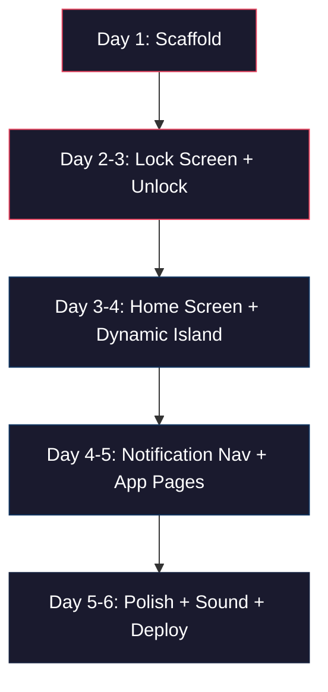

# BITENDERS OS — Strategic Build Analysis

> **Purpose:** Answer every question you need answered before writing the first line of code.

---

## 🎯 The Goal (Crystal Clear)

Build an **interactive investor demo** that looks and feels like an iPhone OS — lock screen, PIN unlock, Dynamic Island, notification-center-as-navigation, and 3–5 "app" pages — all running in a browser. The product is **BITENDERS OS**, positioned as *"a preview of intelligent digital identity systems."*

**Success metric:** An investor opens the link on their phone, sees a lock screen, swipes up, enters a PIN, and within 10 seconds says *"whoa."*

This is **not** a traditional web app. It's a **theatre piece** disguised as software.

---

## 🧬 Recommended Repo Combination (The "Easy Mode" Stack)

Clone these **5 repos** and you'll have 80% of the hard problems pre-solved:

### Tier 1 — Must Clone (Foundation)

| # | Repo | What It Gives You | Clone Command |
|---|------|-------------------|---------------|
| 1 | **Next.js (App Router)** | Framework, routing, SSR, Docker-ready | `npx -y create-next-app@latest ./` |
| 2 | **[react-live-island](https://github.com/nanxiaobei/react-live-island)** | Drop-in Dynamic Island component with expand/collapse animations | `git clone https://github.com/nanxiaobei/react-live-island.git` |
| 3 | **[picturepan2/devices.css](https://github.com/picturepan2/devices.css)** | Pure CSS iPhone frame mockup (for desktop "kiosk" view) | `git clone https://github.com/picturepan2/devices.css.git` |

### Tier 2 — Highly Recommended (Acceleration)

| # | Repo | What It Gives You | Clone Command |
|---|------|-------------------|---------------|
| 4 | **[Amooryjubran/iphone-simulator](https://github.com/Amooryjubran/iphone-simulator)** | Working iPhone home screen grid, app-open animations, OS state patterns | `git clone https://github.com/Amooryjubran/iphone-simulator.git` |
| 5 | **[Konsta UI](https://github.com/nickelback-club/konsta)** | iOS-native-feeling components (lists, cards, navbars) built for Tailwind | `npm install konsta` |

### Tier 3 — Reference Only (Study, Don't Clone)

| # | Repo | What to Study |
|---|------|--------------|
| 6 | **[amelie-schlueter/dynamic-island-web](https://github.com/amelie-schlueter/dynamic-island-web)** | How to animate Dynamic Island with Framer Motion `layout` prop |
| 7 | **[tddworks/claude-skills](https://github.com/tddworks/claude-skills)** | Agent skill patterns — useful for **post-MVP** when adding AI agents as "apps" |
| 8 | **Motion.dev "iOS Notifications Stack" example** | Variant-based stacked card animation patterns |

> [!IMPORTANT]
> The `claude-skills` repo is **not relevant to the MVP build**. It's a collection of Claude AI agent skill definitions (iOS/macOS Tuist development patterns). Bookmark it for Phase 2 when you add "AI agents as apps" to the home screen. It will not help you ship the demo.

---

## 🚀 Starting Point — Build Sequence



### Day 1 — Scaffold
1. `npx -y create-next-app@latest ./` (App Router, Tailwind, TypeScript)
2. Install: `framer-motion`, `zustand`, `konsta`
3. Copy `devices.css` into `/public/css/`
4. Set up the Zustand store (lock state, active screen, PIN, notifications, active app)
5. Create the folder structure from the handoff (`/features/lockscreen`, `/features/notifications`, etc.)

### Day 2–3 — Lock Screen (THE Critical Feature)
- Background video with `backdrop-filter: blur(20px)` overlay
- Live clock component
- Swipe-up gesture (Framer Motion `drag="y"` + `onDragEnd`)
- PIN keypad (1–9 grid) with tap sound feedback
- Unlock animation → transition to home

### Day 3–4 — Home Screen + Dynamic Island
- Integrate `react-live-island` at viewport top
- Study `iphone-simulator` for grid layout patterns
- App icons → tap → scale+fade transition into app page

### Day 4–5 — Notification Center + App Pages
- Pull-down gesture from top
- Stacked cards with `AnimatePresence` + variants
- Build 4 pages: Home, About, Contact, Privacy
- Each page uses Konsta UI components for iOS fidelity

### Day 5–6 — Polish + Deploy
- Add tap sounds (Web Audio API — short MP3 buffers)
- Micro-animations on every interaction
- Lazy-load video, compress assets
- Docker build → deploy to Vercel/Render

---

## ⚠️ What You Should Worry About

### 🔴 Critical Risks

| Risk | Why It Matters | Mitigation |
|------|---------------|------------|
| **Animation jank on mobile Safari** | iOS Safari handles `backdrop-filter` + video + Framer Motion poorly. 60fps is hard. | Test on real iPhone early (Day 2). Use `will-change` sparingly. Prefer `transform` over `top/left`. |
| **Video autoplay blocked on mobile** | iOS blocks autoplay with sound. Even muted autoplay can fail. | Use `muted playsInline autoPlay` attributes. Have a static fallback image. |
| **Scope creep** | The handoff lists 15+ features. You need 5 to "wow." | MVP = Lock screen + PIN + Home grid + 2 app pages + Dynamic Island. Everything else is post-demo. |
| **Touch gesture conflicts** | Swipe-up unlock vs. browser swipe-to-refresh vs. notification pull-down — they'll fight. | Use `touch-action: none` on the body. Capture all gestures within your app. Consider `overscroll-behavior: contain`. |

### 🟡 Moderate Risks

| Risk | Mitigation |
|------|------------|
| **Web Audio API inconsistency** | Pre-load sounds in a user gesture handler (first tap). Use AudioContext resume pattern. |
| **Tailwind + Konsta UI class conflicts** | Use Konsta's `tailwind` plugin properly. Namespace custom utilities. |
| **"It doesn't look real enough"** | The blur + depth + shadow trinity is non-negotiable. Spend 30% of time on CSS polish. |

### 🟢 Low Risks (But Acknowledge Them)

- Accessibility — this is a demo, not a production app, but add `aria-labels` on interactive elements
- SEO — irrelevant for a demo, but Next.js gives you meta tags for free
- Cross-browser — target Chrome + Safari mobile only for demo day

---

## 💰 Cost of Development

### Developer Time (The Real Cost)

| Role | Hours | Rate (Est.) | Cost |
|------|-------|-------------|------|
| **Solo full-stack dev** (doing everything) | 40–60 hrs | $50–150/hr | **$2,000–$9,000** |
| **With AI pair programming** (Antigravity/Copilot) | 25–40 hrs | $50–150/hr | **$1,250–$6,000** |
| **Junior dev following this guide** | 80–120 hrs | $25–50/hr | **$2,000–$6,000** |

### Tooling & Infrastructure Cost

| Item | Cost | Notes |
|------|------|-------|
| **Next.js** | Free | Open source |
| **Framer Motion** | Free | Open source |
| **Zustand** | Free | Open source |
| **Konsta UI** | Free | Open source |
| **Tailwind CSS** | Free | Open source |
| **Vercel Hosting (Hobby)** | **$0/mo** | Demo-only; 100GB bandwidth; **no commercial use** |
| **Vercel Hosting (Pro)** | **$20/mo** | Required for investor-facing / commercial use |
| **Render Hosting** | **$0–7/mo** | Alternative; free tier available but spins down |
| **Docker self-host (VPS)** | **$5–12/mo** | DigitalOcean, Hetzner, etc. |
| **Domain name** | **$10–15/yr** | `.com` or `.io` |
| **Stock video for lock screen BG** | **$0–30** | Use Pexels/Pixabay for free, or Shutterstock for premium |
| **Sound effects** | **$0** | freesound.org, mixkit.co |

### Total MVP Cost (Tooling Only)

| Scenario | Monthly | One-Time |
|----------|---------|----------|
| **Absolute minimum (Vercel free + free assets)** | **$0/mo** | **$10 domain** |
| **Professional demo (Vercel Pro + domain + VPS backup)** | **$20–32/mo** | **$10–45** |

> [!TIP]
> For an investor demo, Vercel Pro at $20/mo is the sweet spot. You get custom domain, analytics, instant deploys from Git, and it handles the Docker complexity for you.

---

## 🔒 Security Implications

### What's Actually Exposed

This is a **static/SSR frontend with no backend API, no database, and no user data**. The attack surface is narrow — but not zero.

| Vector | Risk Level | Details |
|--------|-----------|---------|
| **PIN is client-side only** | ⚠️ **Medium** | The PIN check runs in JavaScript. Anyone can inspect DevTools and bypass it. This is fine for a demo — the PIN is theatrical, not security. |
| **No authentication** | ✅ Low | By design (handoff says "zero friction, no login required"). No user sessions = nothing to steal. |
| **Source code exposure** | ✅ Low | It's a frontend. All code is visible in the browser. Don't embed API keys, secrets, or investor data in the bundle. |
| **Dependency supply chain** | ⚠️ **Medium** | You're pulling in ~8 npm packages. Run `npm audit` before every deploy. Pin versions in `package-lock.json`. |
| **Vercel / hosting platform** | ✅ Low | Vercel has SOC 2 compliance. Your demo is static — no serverless functions = no injection surface. |
| **Video/audio assets** | ✅ Low | Self-hosted media. No external API calls. No tracking pixels (unless you add analytics). |

### Security Checklist Before Demo Day

```
☐ No API keys, tokens, or secrets in client code
☐ No real investor data embedded in the app
☐ npm audit shows 0 critical vulnerabilities
☐ HTTPS enforced (Vercel does this by default)
☐ No eval(), innerHTML with user input, or dynamic script loading
☐ Content Security Policy headers set (Next.js middleware)
☐ PIN is clearly documented as "demo mode" — not real auth
```

> [!WARNING]
> **Do NOT** build real authentication for the MVP. The PIN is a UX element, not a security gate. If you need real auth later (post-MVP user sessions), use NextAuth.js or Clerk — never roll your own.

---

## 🖥️ Compute Resource Requirements

### Development Machine

| Resource | Minimum | Recommended |
|----------|---------|-------------|
| **RAM** | 8 GB | 16 GB |
| **CPU** | Any modern dual-core | Quad-core+ |
| **Disk** | 2 GB free (node_modules + build) | 5 GB |
| **Node.js** | v18+ | v20 LTS |
| **Browser** | Chrome + Safari (for testing) | + Firefox for good measure |

### Production Hosting

| Metric | Expected Load (Demo) | Vercel Hobby Limit | Vercel Pro Limit |
|--------|----------------------|--------------------|--------------------|
| **Bandwidth/mo** | 1–5 GB | 100 GB | 1 TB |
| **Requests/mo** | 1,000–10,000 | 1M edge requests | 10M edge requests |
| **Build time** | 30–60 seconds | 6,000 min/mo | 24,000 min/mo |
| **Cold start** | N/A (static) | N/A | N/A |

### Docker Self-Host (Alternative)

| VPS Spec | Cost | Handles |
|----------|------|---------|
| 1 vCPU, 1 GB RAM, 25 GB SSD | ~$5/mo | Up to ~500 concurrent users |
| 2 vCPU, 2 GB RAM, 50 GB SSD | ~$12/mo | Up to ~2,000 concurrent users |

> [!NOTE]
> For an investor demo, you will never hit these limits. Even the free Vercel tier is overkill. The only reason to pay is for **custom domain** and **commercial use rights**.

---

## 🏁 Bottom Line — Decision Matrix

| Question | Answer |
|----------|--------|
| **What repos to clone?** | Next.js starter + `react-live-island` + `devices.css` + study `iphone-simulator` |
| **Starting point?** | `npx create-next-app`, then build lock screen first |
| **The goal?** | A 10-second "wow" for investors in a browser |
| **What to worry about?** | Mobile Safari animation perf + video autoplay + scope creep |
| **Dev cost?** | $0 tooling; $1,250–$9,000 labor depending on approach |
| **Hosting cost?** | $0–20/mo |
| **Security risk?** | Low — no backend, no data, PIN is theatrical |
| **Compute needed?** | Laptop for dev, free Vercel for prod |

---

> **Next step:** Say the word and I'll scaffold the entire project structure, install dependencies, and build the lock screen component first.
